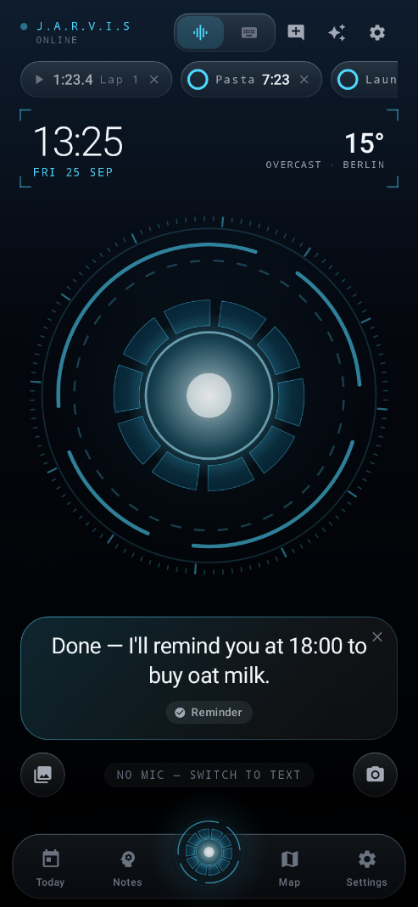
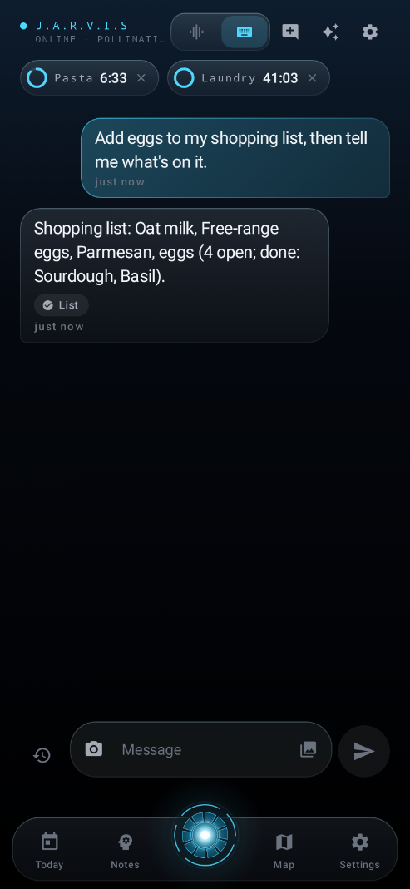
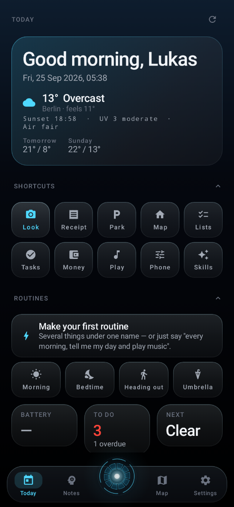
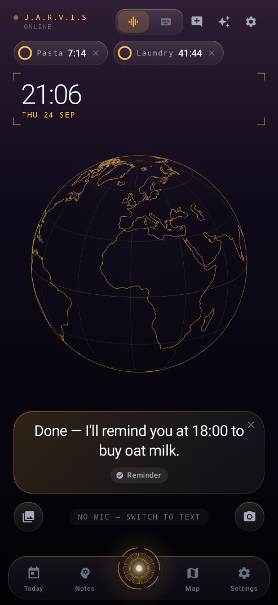

# Jarvis — your own AI assistant

An Android app you talk to, built as a heads-up display around an arc
reactor. It remembers what you tell it, keeps running totals of anything you
count, reminds you about things, reads, sees, searches the live web, draws
pictures and runs your phone — and it is **yours**: its name, its
personality, how it addresses you, its voice and its colour are all your
choice.

**No account, no API key, no cost.** Jarvis answers from the very first
launch through free, keyless public models. A free key of your own (Groq,
Google Gemini, …) is optional and only makes it quicker and cleverer. Paid
providers are not in the app at all.

> "I bought chips for two euros" → logged.
> Later: "how much have I got left?" → it knows, because it did the arithmetic,
> not because a language model guessed.

<p align="center">
  
  
  
  
</p>

The pictures are rendered from the real app by the *Jarvis screenshots*
workflow (any commit whose message contains `[screens]`); all of them are in
[`docs/screens`](../docs/screens). The second is a live turn: the free, keyless
model was asked to add eggs to the shopping list and read it back, and did.

## What's new in 5.5

- **Reminders at a place** — "remind me to buy milk when I get home", "when
  I leave work, remind me to call Mum", "every time I get to the gym…". The
  phone's own location service watches the spot, so nothing runs in between
  and no Google services are needed. They sit on the Tasks tab under *At
  places*, and one set while you are already there waits for the next arrival.
- **The phone's own buttons by voice** — "lock the phone", "take a
  screenshot", "go back", "open notifications", "quick settings", through the
  screen access you already switched on for reading.
- **Remembers with no connection** — "remember that my locker code is 3917"
  is kept even when no model can be reached, and "what's my locker code?" is
  answered from memory the same way.
- **Rides out a busy moment** — a model that fails with a passing error (a
  502 from a busy gateway, a dropped connection) gets one more try before the
  turn gives up.
- **Fixes** — "take me home" before home was saved used to search the map
  for a place called "Home"; a saved "car" matched "Carrefour".

## What's new in 5.4

- **Lists** — shopping, packing, anything without a time, by voice or on the
  new Lists tab; "Einkaufsliste" and "groceries" are the same list.
- **Timers Jarvis runs itself** — named, on screen and in the shade, ringing
  until stopped (a tap, or just "stop"), and "how long is left on the pasta"
  has an answer.
- **The phone's controls** — volume, brightness, Do Not Disturb with an end
  time, and the Devices screen as a control centre.
- **Calendar that finishes the job** — events are added, moved and cancelled
  in your calendar, not just filled in, and one with a place gets a "time to
  leave" reminder from the real travel time.
- **What's playing** — the song, artist and app, and controls that reach the
  app that is playing.
- **Weather with more in it** — when the rain starts, sunrise and sunset, UV,
  air quality and pollen; the town's name and the weekday.
- **Morning brief and evening wrap-up** as notifications at times you choose.
- **Works offline** — timers, alarms, reminders, the torch, volume, music,
  lists, apps, sums and more are understood with no connection at all, and
  the header says when you are offline.
- **Backup that keeps everything** — memories, tasks, trackers, lists and the
  conversation, not only settings and keys.
- **Your own colour** — any accent from a rainbow slider, and each
  personality speaks at its own pace and pitch.
- **Routines to start from** — Morning, Bedtime and Heading out, one tap on
  Today.
- **The day on the home screen** — the widget shows the weather, what is
  due and the next appointment.
- **Fixes** — a Today screen that crashed on phones that do not report their
  battery, a clock squeezed into one column, a core that stayed open whenever
  the location was known, repeating tasks that ended when ticked off, numbers
  like "2,50" or "50%" misread, and more — most of them found by rendering
  the app in CI.

## Getting the APK

There is no Android SDK in this repo, so the APK is built by GitHub Actions.

**On your phone — easiest.** Open
[Releases](https://github.com/Lukas787-tech/projects/releases), tap the
`jarvis.apk` on the `jarvis-latest` release, and allow "install unknown
apps" when the browser asks. No login, no unzipping.

To refresh that link after changes: **Actions** -> **Build Jarvis APK** ->
**Run workflow** -> tick *Also publish the APK as a GitHub Release*.

**From a computer.** Every push also uploads a `jarvis-apk` artifact on the
workflow run, which is a zip you download and extract.

Every build is signed with the throwaway key in `app/keystore/`, so new versions
install over old ones without an uninstall. That key is not a secret and is not
for Play Store use — it exists so upgrades work.

## First run

Open the app. A one-minute introduction asks what to call you and how you
like to be addressed ("sir", "boss", your name…), lets you pick the
assistant's personality and colour — both change live as you tap — and
whether you mostly talk or type. Then tap the core and talk.

That is all the setup there is. Everything below is optional.

### Making it yours (Settings)

| Tab | What you can change |
|---|---|
| **You** | Its name and yours, how it addresses you, seven personalities (J.A.R.V.I.S., F.R.I.D.A.Y., best friend, executive assistant, coach, calm, wisecracker) or your own, reply length, how much wit, a fixed reply language, follow-up offers, emoji, and two free-text boxes — *about you* and *how it should behave* — that go into every conversation |
| **Voice** | Speak replies, hands-free, listening tones, haptics, speed, pitch, any voice installed on the phone, the language to listen and speak in, and the wake word |
| **Look** | Eight accent colours or any colour from a rainbow slider, five backdrops, the core (arc reactor, orb or globe), heads-up readouts, calm motion, text size |
| **Brain** | The free built-in AI (on by default), and optional free keys for faster, smarter models |
| **Powers** | Which abilities are switched on, maps, automation, the floating dot |
| **Data** | Backup and restore — one file with every memory, task, tracker, the conversation, routines, places, settings and keys — clearing the chat, replaying the introduction |

### Optional: a free key of your own

| Provider | Free key | Notes |
|---|---|---|
| **Groq** | console.groq.com/keys | Fastest. |
| **Google Gemini** | aistudio.google.com/apikey | Generous limits; lets Jarvis *see* photos with a model. |
| **Cerebras** | cloud.cerebras.ai | Very fast. |
| **OpenRouter** | openrouter.ai/keys | Models ending `:free` cost nothing. |
| **Mistral**, **GitHub Models**, **SambaNova**, **Z.ai**, **Cohere**, **Chutes**, **Scaleway**, **Cloudflare** | — | More standing free tiers. |
| **NVIDIA**, **Hugging Face**, **Nebius**, **Together**, **Novita**, **Hyperbolic**, **DeepInfra**, **Moonshot**, **Qwen** | — | Free credit on signup. |
| **Ollama**, **LM Studio**, **llama.cpp**, **vLLM** | — | Your own PC. See below. |

Paste a key under **Settings → Brain → Add a free key**, then tap **Add** in
the model pool. Keys you add are used before the keyless ones.

No costs anywhere: the models are free, speech-to-text and text-to-speech
are the ones built into Android, photo reading runs on the phone, and every
web source Jarvis uses answers without a key.

## Ways in

- **The core** in the dock: one tap talks from any screen; a long press types.
- **The wake word**: "Jarvis, what's the weather?" — answered out loud even
  while the app is closed (optional, uses more battery).
- **The floating dot** over other apps.
- **Quick Settings tile**: pull down the shade, tap, talk.
- **Home-screen widget**: talk, type or scan.
- **Launcher shortcuts**: long-press the icon for Talk, Type, Scan, Today.
- **Share to Jarvis** from any app — a link is read and summarised, text is
  explained, a picture is looked at — or pick *Ask Jarvis* on selected text.
- **The assistant gesture** (long-press power / home) if you make Jarvis the
  phone's assistant.

## What it does

**Answers as it thinks.** Replies stream in word by word, and spoken replies
start with the first finished sentence instead of after the whole answer.

**Draws.** "Draw a fox in a space suit" puts a picture in the chat, free
and keyless (Pollinations). Tap it to save it to the gallery or share it.

**Runs the house.** Connect your own Home Assistant (Settings → Powers →
Smart home: its address and a long-lived token) and Jarvis switches and dims
lights, plugs and fans, opens blinds, locks doors, sets the heating, runs
scenes, and tells you which lights are on or whether the door is locked.
Local and free — no cloud account.

**Reads your screen, when asked.** With screen reading switched on (Settings
→ Powers), "summarise this", "what does this say" or "reply to this" from the
floating dot or the wake word works on whatever app you are in. It reads
nothing at any other time and keeps nothing.

**Greets the morning.** On the first open of a morning it says how the day
looks — the weather, what is due, the next appointment, the budgets and the
top story — gathered on the phone, so it costs no model quota. Pick a time
under *Written brief* (Settings → Voice) and the same brief arrives as a
notification every morning, without opening the app. An *Evening wrap-up* at
a time you pick says what got done and spent today, what is still open, and
what tomorrow holds — the first appointment, what is due, and the weather.

**Works with no connection.** When no model can be reached — no signal, or
every free quota spent — timers, alarms, "remind me in 20 minutes to…", the
torch, the volume, Do Not Disturb, pausing or skipping music, opening an app,
the battery, the time, sums, a coin or a die are still understood (English and
German) and done by the same code the model would have used.

**Starts fresh when you want.** *New conversation* clears the thread and the
model's context without deleting anything; the full history is one tap away.

**Knows what's going on.** Headlines in your language (Google News, with the
BBC behind it), share and crypto prices with the day's move, public
holidays, recipes, football scores and fixtures, TV shows and when the next
episode airs, books, a dictionary, translation, and real coin flips and dice.


**Remembers.** Tell it anything — a door code, a preference, a plan, where you
put something — and it stores it. Ask later and it searches its memory before
answering. Retrieval is BM25 over a locally built index, nudged by importance
and recency. Everything it knows is on the Memory screen: search it, filter it
by kind, pin what should always be in mind, and tap any memory to correct it.

**Counts things.** Any purchase or countable activity becomes an entry on a
tracker. A tracker is a named number with a unit, optionally a starting balance
and a budget that resets daily, weekly or monthly. Money is the obvious case;
calories, kilometres and gym sessions work identically. The totals are computed
in SQL, so they are exact.

**Reminds.** Anything with a time becomes a task with a real Android alarm and
notification. Repeating tasks roll themselves forward — ticking one off
finishes that time, not the series, and a phone that was off for days skips to
the next one ahead instead of ringing every missed one. "Move that to Friday",
"snooze it ten minutes" and "cancel the dentist" move or remove the task and its
alarm rather than adding a second one.

**Keeps lists.** "Add oat milk to the shopping list", "put sunscreen on the
packing list", "what's on my shopping list", "I got the eggs". Any number of
named lists, one of each thing per list, and "groceries" or "Einkaufsliste"
find the same one. The Lists tab shows them with a box to tick for each item.

**Runs timers you can ask about.** "Ten minutes for the pasta" starts a named
countdown that shows under the assistant's name and in the notification shade,
rings until you stop it, and is spoken if the app is open. "How long is left on
the pasta", "give it five more minutes" and "stop the timer" all work — which a
timer handed to the clock app never could.

**Searches the web.** For anything current or outside the model's knowledge —
DuckDuckGo first, then Mojeek, then Wikipedia's own search if both are busy.

**Does the arithmetic itself.** Percentages, splitting a bill, unit prices and
conversions go through a parser rather than through the model, which is the
difference between a number that is right and a number that looks right. The
same goes for dates — "how many days until Christmas", "what date is three weeks
from now" are counted by `java.time`, not guessed — and for money in another
currency, which is converted at the day's European Central Bank rate
(Frankfurter, with open.er-api.com as the fallback; no key either way).

**Takes things back.** "Undo that" removes the last entry from its tracker and
reads out the corrected balance, so a misheard amount is one sentence away from
fixed.

**Tells you the weather.** Real forecasts for where you are or anywhere you
name, from Open-Meteo — no key, no account: when the rain starts, sunrise and
sunset, the UV index, European air quality and high pollen, on the Today card
and out loud.

**Runs the phone.** Alarms and timers in your own clock app, the torch, the
ringer, every volume, screen brightness (as the percentage the slider shows),
Do Not Disturb — "no calls for an hour" ends by itself — the clipboard,
battery and network and storage readouts, any installed app by name, and any
page of Android settings. Brightness and Do Not Disturb each need one switch
flipped in Android's own settings the first time; Jarvis opens the page. The
**Devices** screen is the same as a control centre: ring / vibrate / silent,
Do Not Disturb, the torch and auto-brightness as switches, and media, ring,
alarm and brightness as sliders that start where the phone really is.

**Reaches people, and finishes the job.** Texts are sent, WhatsApp, Signal and
Telegram messages are answered straight from their notification, and new chats
are typed out and sent where accessibility allows. A call is read back — name
and number — and only rings after you say yes. Calendar events go straight
into your calendar with a reminder (or, without calendar write access, are
filled in for you to save — and it says which). Emails are filled in for you to
send, and it says so rather than claiming the job is done.

**Reads your day.** With calendar and contacts switched on it knows what is on
today and who is in your address book. Ask "how does my day look" and it
gathers the weather, what is due, the next appointment and your budgets in one
pass — the same day the **Today** screen draws.

**Looks back.** It searches not only its memory but the conversations
themselves: "what did I tell you about the landlord" finds the turn.

**Finds places and draws the way there.** "I'm hungry, what's around here" pins
real restaurants on a map with distances; "how do I get to the second one" draws
the route and tells you the distance, the time and the first turns. Tap
**Navigate** on any pin to hand it to Google Maps for turn-by-turn. The data is
OpenStreetMap — Overpass for what is nearby, Nominatim for names and addresses,
OSRM for routing, and the standard OSM tiles for the map itself, which is why
there is no API key and no bill here either. Location stays on the phone; it is
only ever sent as the coordinates of a lookup.

**Sees.** Tap the camera (or say "what is this", "read this sign", "scan this
receipt") and Jarvis looks through the phone's camera. The phone itself reads
the text, recognises objects and decodes QR codes and barcodes, offline and
with no key; if your pool has a model that can see (a free Gemini key does),
it describes the scene as well. What the picture shows is written out in
words, so the rest of the turn runs on any model: a receipt is logged to the right tracker, a poster's date becomes
a reminder, a business card is remembered. The gallery works too.

**Remembers places.** "I parked here", "this is home", "save this as work".
"Take me home" or "where's my car" then draws the way, and the Today screen
and the map carry one-tap buttons for each. "Send Anna my location" texts a
map link.

**Reminds you at a place.** "Remind me to post the letter when I get to
Alexanderplatz", "when I leave work, remind me to take the charger", "every
time I get home, remind me to water the plants". Saved places, shops and
addresses all work; "here" is where you are. Android's own proximity alerts
do the watching, so it costs no battery while nothing happens. For it to fire
with Jarvis closed, location has to be allowed *all the time* — Jarvis asks
the first time you set one.

**Presses the phone's buttons.** With screen reading switched on, "lock the
phone", "take a screenshot", "go back", "go home", "recent apps", "open
notifications", "quick settings", "power menu" and "split screen" work by
voice, including from the floating dot while another app is open.

**Runs routines.** Several things under one name — "every morning at seven,
tell me my day, the weather, and play the radio". Say its name, tap it on
Today, or tap the notification that arrives at its time; each step runs as its
own turn and one summary is spoken at the end.

**Looks things up on Wikipedia** in the phone's language, for "tell me about…".

**A real map.** Full screen, with sharp double-resolution tiles in dark, light
or satellite, a live blue dot with its accuracy circle and a compass cone for
the way you are facing, the street you are on at the top, zoom and locate-me
buttons, double-tap zoom, a scale bar, and results in a sheet that folds away.
Going from the globe to the map is one camera move: the globe turns the place
to the front and closes in, and the map opens in a circle at the same scale and
keeps zooming.

**Speaks.** Replies are read aloud, and hands-free mode hands the microphone
straight back so you can keep talking.

**Shows its work.** While a turn runs, the tools it reaches for appear one by
one under the dot — *Memory*, *Weather*, *Calendar* — with the newest one
pulsing, so a slow answer says what it is waiting on. Once it has answered, the
same chips stay under the reply as a receipt for where each number came from.

**Says what it can do.** The **Skills** screen (the sparkle on the assistant
screen, or just ask "what can you do") lists every ability with the sentences
that reach it. Tap one and it is asked for real.

Each group of abilities is a switch, on the Skills screen and in **Settings ->
Abilities**. Turning one off takes its tools away from the model entirely, which
keeps a small free-tier model's choices short — and calendar and contacts only
ask for their Android permission at the moment you switch them on. A switched-off
tool is never run behind your back, even if a model asks for it by name.

The key trick is that before every reply, the app injects your current tracker
balances, open tasks and the memories most relevant to what you just said. So
you get "you've got 23 euros left this week" without having to ask.

## Talking to your own PC (Ollama)

Choose the **Ollama** provider and set the base URL to your machine, e.g.
`http://192.168.1.50:11434/v1`. Start Ollama with
`OLLAMA_HOST=0.0.0.0 ollama serve` so it accepts connections from the phone.
This works while you are on the same Wi-Fi.

Making it work from outside the house is the PythonAnywhere relay, which is not
built yet — it will be a small OpenAI-compatible proxy that forwards to your home
machine, and the app will need no changes beyond pointing the **Custom endpoint**
provider at it.

## Wake word

Optional, off by default, and worth being honest about: Android has no free
always-on hotword engine, so this loops the normal speech recognizer and watches
for your phrase. It costs noticeably more battery than a real hotword chip.
Because Android 10+ will not let a background app bring itself forward, the
request is answered and spoken right where you are, without opening the app:
say "Jarvis, set a timer for ten minutes" in one breath, or "Jarvis", wait for
the tone, then ask.

## Building locally

Needs JDK 17 and the Android SDK (platform 35).

```bash
./gradlew assembleRelease
# app/build/outputs/apk/release/app-release.apk
```

## Layout

```
app/src/main/java/com/lukas/jarvis/
  brief/      the day, gathered once for the screen and the spoken answer
  control/    the phone: media, device switches, app and intent handovers,
              contacts, calendar
  core/       settings, time parsing, the calculator, unit conversion, dates
  data/       SQLite schema, models, BM25 retrieval, tracker maths
  llm/        OpenAI-compatible client, tool definitions and catalog, agent
              loop, prompt
  voice/      speech recognition, text to speech, wake word service
  maps/       places, routing, location, map tiles and state
  web/        DuckDuckGo search, page reader, weather, exchange rates, news,
              translation, markets, holidays, recipes, sports, pictures
  vision/     the camera, and on-device text, object and barcode reading
  surface/    the Quick Settings tile, the widget and the launcher routes
  overlay/    the floating dot and the screenless spoken turn
  notify/     alarms and notifications
  ui/         theme and design tokens, shared parts, screens, the map canvas
  vm/         view model
```

Every provider speaks the OpenAI chat-completions dialect, so switching between
a cloud model, your own Ollama box and a future relay is a base URL and a model
name — nothing in the client changes.

## Staying inside the free tiers

A pool of endpoints only helps if it is used carefully, so the rotation is built
around not hitting limits rather than recovering from them:

- **Every call is counted before it is sent**, against the provider's published
  free-tier rate and against whatever its `x-ratelimit-*` headers report. An
  endpoint near its ceiling loses its turn to one with room, so the limit is
  usually never reached.
- **Limits are tracked per account, not per model.** A daily cap is charged to
  the key, so when one is hit the whole account rests instead of each of its
  models spending a request to discover the same wall. Escaping a daily cap
  means a second account — which is why the pool spans providers.
- **The shape each endpoint accepts is remembered.** Providers disagree about
  `temperature`, `max_tokens` and `tools`; finding that out costs a rejected
  request, so it is learned once and reused. Tool calling is given up last
  rather than first, because it is what reaches your memory and trackers.
- **A daily cap rests until midnight UTC**, a stated `Retry-After` is obeyed
  exactly, and everything else backs off with jitter so a pool that failed
  together does not wake together.
- **One turn walks at most five endpoints.** The tenth failure costs the same as
  the second and says the same thing.
- **Each turn is offered only the tools its words point at.** Seventy tool
  definitions on every request cost thousands of tokens and make small models
  pick the wrong one; the families a sentence mentions (in English or German),
  plus memory and exact answers, are enough — and any switched-on tool still
  runs if a model asks for it by name.
- **Prompts are kept small.** History is trimmed and tool output clamped, since
  tokens per minute are metered as strictly as requests.
- **A small model's mistakes are caught, not paid for.** `get_weather` is taken
  to mean `weather`, a lookup asked for twice in one turn is answered from the
  first result, and a turn that starts asking for what it already has is told
  to answer instead of spending more rounds. Lookups that do not depend on each
  other run side by side, so weather, calendar and a web search cost one wait.
- **A notice is not an answer.** A free service that has run out sometimes
  replies "200 OK" with a message about credits or a queue instead of an
  answer. That is treated as the endpoint failing — the next one answers — and
  never shown or read out as if Jarvis had said it. Advert footers some add to
  real answers are cut off.
