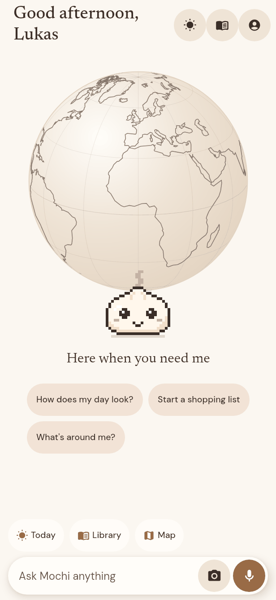
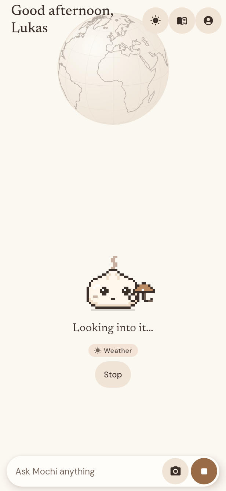
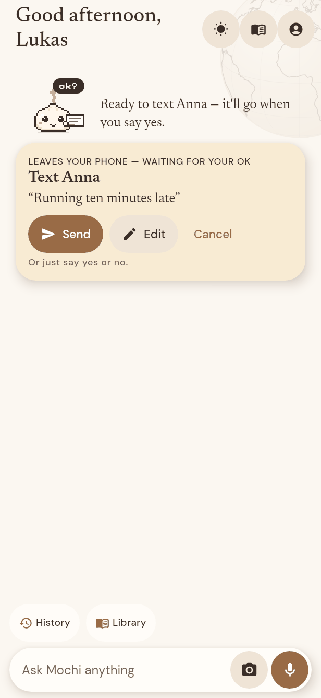
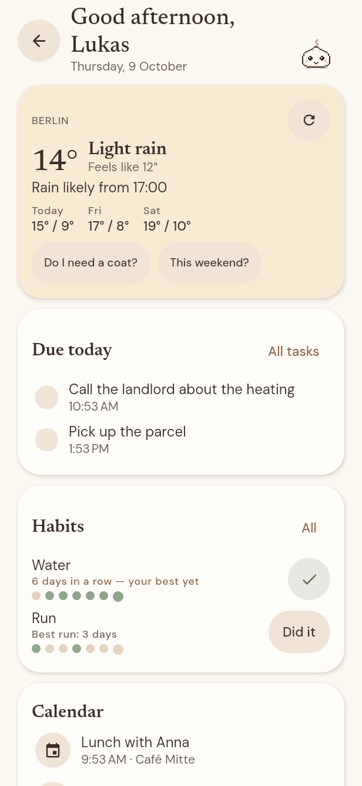
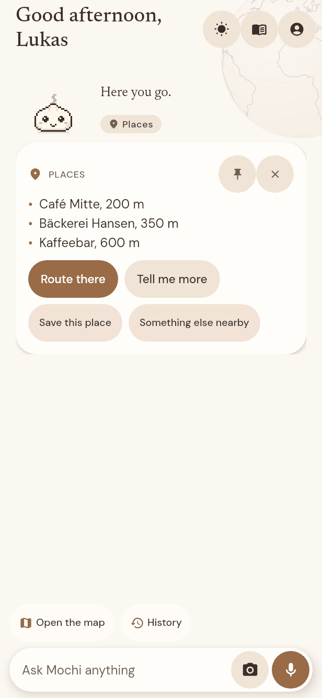
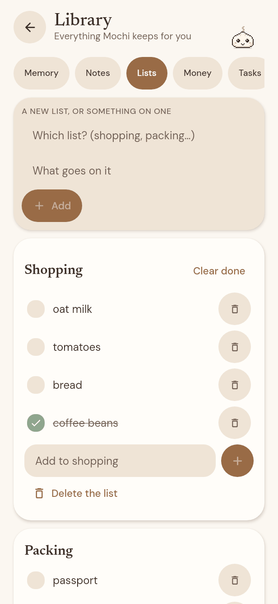
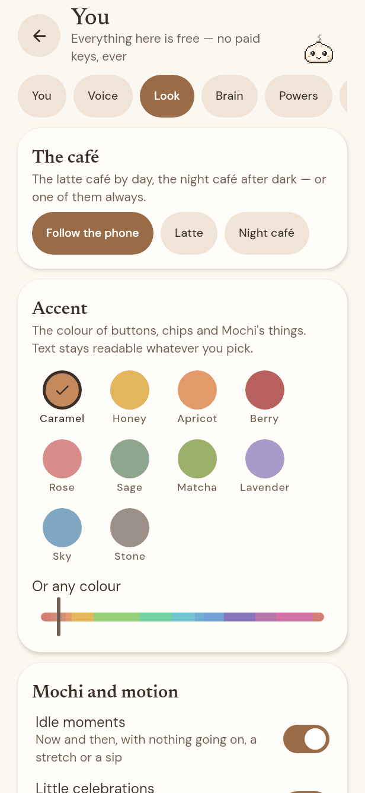
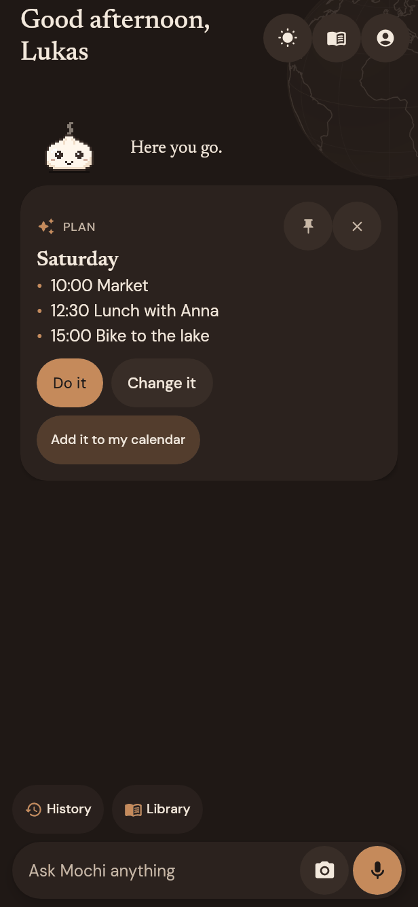

# Mochi — your own AI assistant

An Android app you talk to, set in a cosy café. **Mochi**, a small steamed
bun drawn in pixels, listens, thinks, holds up whatever it is using and
celebrates when the job is done. Every pose comes from what the assistant is
really doing. It remembers what you tell it, keeps running totals of anything
you count, reminds you about things, reads, sees, searches the live web,
draws pictures and runs your phone. And it is **yours**: its name, its
character, how it addresses you, its voice and its colour are all your
choice.

**No account, no API key, no cost.** Mochi answers from the very first
launch through free, keyless public models. A free key of your own (Groq,
Google Gemini, …) is optional and only makes it quicker and cleverer. Paid
providers are not in the app at all.

> "I bought chips for two euros" → logged.
> Later: "how much have I got left?" → it knows, because it did the arithmetic,
> not because a language model guessed.

<p align="center">
  
  
  
  
</p>
<p align="center">
  
  
  
  
</p>

The pictures are the app's own screens drawn with sample data. The *Mochi
screenshots* workflow renders the same screens on CI (any commit whose
message contains `[screens]`).

## What's new in 6.0

A new look and a new name: the heads-up display is gone and the café is in.
The assistant underneath is the same, with the same memory, tools, routines
and free models.

- **Mochi**, a character whose every pose follows what the assistant is
  doing.
- **One canvas** made of *moments* (listening, working, asking you, showing
  an answer…) instead of tabs, and **rooms** for the rest: Today, the
  Library, You, Powers, the map, Music, This phone and the conversation.
- **It asks before anything outward or hard to take back.** A confirmation
  card says what will happen, you can change it, and nothing goes until you
  say yes.
- **Local only**, a switch that keeps your personal things off the free
  public models.
- **Plans** on one card, **habits** that count the days in a row, **trips**
  made ready in one go, and the **shopping list** in the order of the shop.
- **Money, next level**: budgets that speak up once, rent and subscriptions
  that log themselves, this month against last, and real charts on the cards.
- **Routines that start by themselves** on the charger, when a Bluetooth
  device connects, or when a meeting starts.
- **Nudges** (off unless you want them) and **memory upkeep** overnight.
- **Accessibility** checked on CI: words on every control for TalkBack, room
  for a finger on every tap, large text, landscape and reduce motion.
- **"hey mochi"** is the new wake phrase.

Upgrading from 5.5 keeps everything: your data, your settings and your own
name for the assistant. The full list is in [CHANGELOG.md](CHANGELOG.md),
with 5.5 and 5.4 before it.

## Getting the APK

There is no Android SDK in this repo, so the APK is built by GitHub Actions.

**On your phone — easiest.** Open
[Releases](https://github.com/Lukas787-tech/projects/releases), tap the
`jarvis.apk` on the `jarvis-latest` release, and allow "install unknown
apps" when the browser asks. No login, no unzipping. The file and the
release keep their old names, so the link you already have still works.

To refresh that link after changes: **Actions** -> **Build Mochi APK** ->
**Run workflow** -> tick *Also publish the APK as a GitHub Release*.

**From a computer.** Every push also uploads a `jarvis-apk` artifact on the
workflow run, which is a zip you download and extract.

Every build is signed with the throwaway key in `app/keystore/`, so new versions
install over old ones without an uninstall. That key is not a secret and is not
for Play Store use — it exists so upgrades work. The app's package is still
`com.lukas.jarvis`, so 6.0 updates an installed Jarvis instead of sitting beside
it.

## First run

Open the app. A short introduction in six steps says hello, asks what to call
you and how you like to be addressed ("boss", your name…), lets you pick
Mochi's character and the café's colours (both change live as you tap), asks
whether you mostly talk or type, and ends with **what leaves the phone**. That
step lists exactly what a turn sends to a model, and lets you switch on Local
only before your first question. Then tap Mochi and talk.

That is all the setup there is. Everything below is optional.

### Getting around

The main page is the canvas: Mochi, the latest answer as a card, and the
composer at the bottom. Older cards fold into a strip; tap one to bring it
back, or tap the answer to read the whole conversation. The three buttons at
the top open **Today**, the **Library** (memory, notes, lists, money and
tasks) and **You** (every setting). **Powers** (every ability) is under You.
The map, Music and This phone open when you ask for them ("show me the map",
"what's playing", "open devices"). Every room has a way back and none ends
in a blank page.

### Making it yours (You)

| Shelf | What you can change |
|---|---|
| **You** | Its name and yours, how it addresses you, its character (Mochi, butler, sidekick, best friend, executive assistant, coach, calm, wisecracker) or your own, reply length, how much wit, a fixed reply language, follow-up offers, emoji, quick commands, and two free-text boxes — *about you* and *how it should behave* — that go into every conversation |
| **Voice** | Speak replies, hands-free, listening tones, haptics, speed, pitch, any voice installed on the phone or a Fish Audio voice, the language to listen and speak in, the written briefs, and the wake word |
| **Look** | Light, dark or automatic, ten café accents or any colour from a hue slider, Mochi's idle moments and reduce motion, the map's style, and profiles that save a whole look under a name |
| **Brain** | The free built-in AI (on by default), an optional free key of your own, and the model pool |
| **Powers** | Which abilities are switched on, places and maps, sending things, reading the screen, smart home, floating Mochi, money and memory, thinking |
| **Data** | Local only, backup and restore (one file, optionally locked with a passphrase, with every memory, task, tracker, the conversation, routines, places, settings and keys), what Mochi did for you, clearing the conversation, replaying the introduction |

### Optional: a free key of your own

| Provider | Free key | Notes |
|---|---|---|
| **Groq** | console.groq.com/keys | Fastest. |
| **Google Gemini** | aistudio.google.com/apikey | Generous limits; lets Mochi *see* photos with a model. |
| **Cerebras** | cloud.cerebras.ai | Very fast. |
| **OpenRouter** | openrouter.ai/keys | Models ending `:free` cost nothing. |
| **Mistral**, **GitHub Models**, **SambaNova**, **Z.ai**, **Cohere**, **Chutes**, **Scaleway**, **Cloudflare** | — | More standing free tiers. |
| **NVIDIA**, **Hugging Face**, **Nebius**, **Together**, **Novita**, **Hyperbolic**, **DeepInfra**, **Moonshot**, **Qwen** | — | Free credit on signup. |
| **Ollama**, **LM Studio**, **llama.cpp**, **vLLM** | — | Your own PC. See below. |

Open **You → Brain → A key of your own → Set up**, pick the provider, paste
the key, then tap **Add** in the model pool. Keys you add are stored
encrypted and used before the keyless ones.

No costs anywhere: the models are free, speech-to-text and text-to-speech
are the ones built into Android, photo reading runs on the phone, and every
web source Mochi uses answers without a key.

## It asks first

Anything that leaves the phone in your name, or is hard to take back, waits
on a confirmation card. The card says exactly what will happen: who the text
goes to and what it says, which number rings, what gets deleted. You can
change it before it goes. Nothing happens until you tap the button or say
yes, and cancelling sends nothing.

That covers texts, chat messages and replies, calls, emails, sharing, and
sharing where you are. It also covers forgetting a memory, deleting an entry,
a task, a routine or a saved place, changing a calendar event, pressing the
phone's own buttons, and unlocking or opening anything at home. Every tool has
a risk level, and a test fails the build if an outward or hard-to-undo tool
can skip the card. **You → Data → What Mochi did for you** lists what it did.

## Local only

Under **You → Data**, and offered in the introduction.

- **With a model you added yourself** (a free key, or your own Ollama or LM
  Studio), Local only uses only those. It never falls back to the keyless
  public models. If yours can't answer, the turn fails rather than going
  somewhere else.
- **With only the keyless models**, each turn is sealed. What you wrote about
  yourself, your memories, where the phone is, and your contacts, calendar,
  places and weather stay off the conversation. Your name, your totals and
  your open tasks still go along, so Mochi can still count and remind. When it
  can't answer because of this, it says so and tells you how to change it.

## Ways in

- **Mochi** on the canvas: one tap talks; the composer types.
- **The wake phrase**: "hey mochi, what's the weather?" — answered out loud
  even while the app is closed (optional, uses more battery).
- **Floating Mochi** over other apps.
- **Quick Settings tile**: pull down the shade, tap, talk.
- **Home-screen widget**: talk, type or scan.
- **Launcher shortcuts**: long-press the icon for Talk, Type, Scan, Today.
- **Share to Mochi** from any app — a link is read and summarised, text is
  explained, a picture is looked at — or pick *Ask Mochi* on selected text.
- **The assistant gesture** (long-press power / home) if you make Mochi the
  phone's assistant.

## What it does

**Answers as it thinks.** Replies stream in word by word, and spoken replies
start with the first finished sentence instead of after the whole answer.

**Draws.** "Draw a fox in a space suit" puts a picture on the canvas, free
and keyless (Pollinations). Tap it to save it to the gallery or share it.

**Runs the house.** Connect your own Home Assistant (You → Powers →
Smart home: its address and a long-lived token) and Mochi switches and dims
lights, plugs and fans, opens blinds, locks doors, sets the heating, runs
scenes, and tells you which lights are on or whether the door is locked.
Local and free — no cloud account. Unlocking or opening anything asks first.

**Reads your screen, when asked.** With screen reading switched on (You
→ Powers), "summarise this", "what does this say" or "reply to this" from
floating Mochi or the wake word works on whatever app you are in. It reads
nothing at any other time and keeps nothing.

**Greets the morning.** On the first open of a morning it says how the day
looks — the weather, what is due, the next appointment, the budgets and the
top story — gathered on the phone, so it costs no model quota. Pick a time
under *Written brief* (You → Voice) and the same brief arrives as a
notification every morning, without opening the app. An *Evening wrap-up* at
a time you pick says what got done and spent today, what is still open, and
what tomorrow holds — the first appointment, what is due, and the weather.
On Mondays the morning brief also says how last week went for your habits.

**Works with no connection.** When no model can be reached — no signal, or
every free quota spent — timers, alarms, "remind me in 20 minutes to…", the
torch, the volume, Do Not Disturb, pausing or skipping music, opening an app,
the battery, the time, sums, a coin or a die are still understood (English and
German) and done by the same code the model would have used.

**Starts fresh when you want.** *New conversation* clears the thread and the
model's context without deleting anything; the full conversation is one tap away.

**Knows what's going on.** Headlines in your language (Google News, with the
BBC behind it), share and crypto prices with the day's move, public
holidays, recipes, football scores and fixtures, TV shows and when the next
episode airs, books, a dictionary, translation, and real coin flips and dice.


**Remembers.** Tell it anything — a door code, a preference, a plan, where you
put something — and it stores it. Ask later and it searches its memory before
answering. Retrieval is BM25 over a locally built index, nudged by importance
and recency. Everything it knows is on the Library's Memory shelf: pin what
should always be in mind, tap any memory to correct it, or forget it (with an undo).
Overnight on the charger it tidies up: the same thing said twice keeps its best
telling, and a plan for a day a month gone is put away. Nothing is deleted, notes,
the journal and pinned memories are never touched, and the Library lists what was
put away, each with *Bring back* (switch it off under You → Data).

**Counts things.** Any purchase or countable activity becomes an entry on a
tracker. A tracker is a named number with a unit, optionally a starting balance
and a budget that resets daily, weekly or monthly. Money is the obvious case;
calories, kilometres and gym sessions work identically. The totals are computed
in SQL, so they are exact. The Library's Money shelf has a *New tracker*
button, and deleting a tracker asks once more.

**Watches the budget.** When an entry carries a budget past four fifths it says
so once ("Heads up: that's 83% of this month's budget, with 10 days to go"), and
again only if it goes over, or if the pace says the month will. "How is this
month going?" sets this month so far against the same days of last month. The
cards draw it: a meter against each budget, bars with a mark for last month, all
in the café's colours, every row also said in words.

**Logs what repeats.** "My rent is 800 every month on the 1st", "Netflix 12.99
monthly", "I get paid on the 25th". Each one becomes an ordinary entry on its
day, even after a week with the phone off, and the Library shows it under its
tracker with a stop that asks once more. A quiet notification says when one was
logged with the app closed.

**Reminds.** Anything with a time becomes a task with a real Android alarm and
notification. Repeating tasks roll themselves forward — ticking one off
finishes that time, not the series, and a phone that was off for days skips to
the next one ahead instead of ringing every missed one. "Move that to Friday",
"snooze it ten minutes" and "cancel the dentist" move or remove the task and its
alarm rather than adding a second one. They are on the Library's Tasks shelf.

**Keeps lists.** "Add oat milk to the shopping list", "put sunscreen on the
packing list", "what's on my shopping list", "I got the eggs". Any number of
named lists, one of each thing per list, and "groceries" or "Einkaufsliste"
find the same one. The Library's Lists shelf shows them with a box to tick
for each item. The shopping list comes in the order a shop is walked (fruit and
veg, bread, dairy, meat, the cupboard, drinks, the freezer, the household
aisle), and "show my shopping list when I get to Rewe" puts what is still to get
on the screen when you arrive.

**Gets a trip ready.** "I'm going to Lisbon on the 14th for five days" sets up a
countdown on Today, the trip's own packing list for that many nights and the
weather there (a jumper when it is cold, sunscreen when it is hot, an umbrella
when rain is likely), and remembers the trip.

**Runs timers you can ask about.** "Ten minutes for the pasta" starts a named
countdown that shows on the canvas and in the notification shade,
rings until you stop it, and is spoken if the app is open. "How long is left on
the pasta", "give it five more minutes" and "stop the timer" all work — which a
timer handed to the clock app never could.

**Searches the web.** For anything current or outside the model's knowledge —
DuckDuckGo first, then Mojeek, then Wikipedia's own search if both are busy.

**Does the arithmetic itself.** Percentages, splitting a bill, unit prices and
conversions go through a parser rather than through the model, which is the
difference between a number that is right and a number that looks right. The
same goes for dates — "how many days until Christmas", "what date is three weeks
from now" are counted by `java.time`, not guessed — and for money in another
currency, which is converted at the day's European Central Bank rate
(Frankfurter, with open.er-api.com as the fallback; no key either way).

**Takes things back.** "Undo that" removes the last entry from its tracker and
reads out the corrected balance, so a misheard amount is one sentence away from
fixed.

**Tells you the weather.** Real forecasts for where you are or anywhere you
name, from Open-Meteo — no key, no account: when the rain starts, sunrise and
sunset, the UV index, European air quality and high pollen, on the Today card
and out loud.

**Runs the phone.** Alarms and timers in your own clock app, the torch, the
ringer, every volume, screen brightness (as the percentage the slider shows),
Do Not Disturb — "no calls for an hour" ends by itself — the clipboard,
battery and network and storage readouts, any installed app by name, and any
page of Android settings. Brightness and Do Not Disturb each need one switch
flipped in Android's own settings the first time; Mochi opens the page. The
**This phone** room is the same as a control centre: ring / vibrate / silent,
Do Not Disturb, the torch and auto-brightness as switches, and media, ring,
alarm and brightness as sliders that start where the phone really is.

**Reaches people, and finishes the job.** Texts are sent, WhatsApp, Signal and
Telegram messages are answered straight from their notification, and new chats
are typed out and sent where accessibility allows. Every one of them waits on a confirmation card first. A call shows the name
and number and only rings after you say yes. Calendar events go straight
into your calendar with a reminder (or, without calendar write access, are
filled in for you to save — and it says which). Emails are filled in for you to
send, and it says so rather than claiming the job is done.

**Reads your day.** With calendar and contacts switched on it knows what is on
today and who is in your address book. Ask "how does my day look" and it
gathers the weather, what is due, the next appointment and your budgets in one
pass — the same day the **Today** room draws.

**Looks back.** It searches not only its memory but the conversations
themselves: "what did I tell you about the landlord" finds the turn.

**Finds places and draws the way there.** "I'm hungry, what's around here" pins
real restaurants on a map with distances; "how do I get to the second one" draws
the route and tells you the distance, the time and the first turns. Tap
**Navigate** on any pin to hand it to Google Maps for turn-by-turn. The data is
OpenStreetMap — Overpass for what is nearby, Nominatim for names and addresses,
OSRM for routing, and the standard OSM tiles for the map itself, which is why
there is no API key and no bill here either. Location stays on the phone; it is
only ever sent as the coordinates of a lookup.

**Sees.** Tap the camera (or say "what is this", "read this sign", "scan this
receipt") and Mochi looks through the phone's camera. The phone itself reads
the text, recognises objects and decodes QR codes and barcodes, offline and
with no key; if your pool has a model that can see (a free Gemini key does),
it describes the scene as well. What the picture shows is written out in
words, so the rest of the turn runs on any model: a receipt is logged to the right tracker, a poster's date becomes
a reminder, a business card is remembered. The gallery works too.

**Remembers places.** "I parked here", "this is home", "save this as work".
"Take me home" or "where's my car" then draws the way, and the Today room
and the map carry one-tap buttons for each. "Send Anna my location" texts a
map link.

**Reminds you at a place.** "Remind me to post the letter when I get to
Alexanderplatz", "when I leave work, remind me to take the charger", "every
time I get home, remind me to water the plants". Saved places, shops and
addresses all work; "here" is where you are. Android's own proximity alerts
do the watching, so it costs no battery while nothing happens. For it to fire
with Mochi closed, location has to be allowed *all the time* — Mochi asks
the first time you set one. They are on the Library's Tasks shelf under
*At places*.

**Interprets a conversation.** "Be my interpreter for Italian" — or "help me
talk to this person in Japanese" — opens a screen with a button for each of
you. Tap yours and speak: it is translated and said aloud in Italian in an
Italian voice, and the reply comes back in your language. With hands-free on,
the phone listens for the answer by itself, so after the first tap you can
just talk. Translation is MyMemory's free service with the free models as a
fallback; no key.

**Presses the phone's buttons.** With screen reading switched on, "lock the
phone", "take a screenshot", "go back", "go home", "recent apps", "open
notifications", "quick settings", "power menu" and "split screen" work by
voice, including from floating Mochi while another app is open. Each one asks
first.

**Runs routines.** Several things under one name — "every morning at seven,
tell me my day, the weather, and play the radio". Say its name, tap it on
Today (where you can also make, edit and delete one), or tap the notification that arrives at its time; each step runs as its
own turn and one summary is spoken at the end. A routine can keep to some
days ("weekdays", "Mo–Fr", "mon, wed, fri"), and one made of questions can
run *quietly*: "every weekday at 7:30, tell me if I need an umbrella" runs by
itself with the app closed and the answer arrives as a notification (and in
the conversation). With no network at that moment it waits and tries again.
A routine can also start by itself: when the phone starts charging, when a
Bluetooth device connects or goes ("when my car connects, tell me the
traffic"), or when a calendar event starts ("silence the phone"). Only what
some routine waits on is watched, and Android asks once before Mochi may see
Bluetooth devices.

**Nudges, if you want them.** Switched on under You → Voice → Nudges, Mochi now
and then says one useful thing unasked: an appointment somewhere in the next
hour and a half (a tap asks the way there), rain on the way, a budget at nine
tenths, a habit's run about to end, or what is still open in the evening. Never
between ten at night and eight in the morning, never the same thing twice,
three a day at most, each kind with its own switch, and worked out on the
phone without asking any model.

**Looks things up on Wikipedia** in the phone's language, for "tell me about…".

**A real map.** Full screen, with sharp double-resolution tiles that follow
the café (light by day, dark at night) or stay light, dark or satellite, a
live blue dot with its accuracy circle and a compass cone for the way you are
facing, the street you are on at the top, zoom and locate-me buttons,
double-tap zoom, a scale bar, and results on cards that fold away.

**Speaks.** Replies are read aloud, and hands-free mode hands the microphone
straight back so you can keep talking.

**Shows its work.** While a turn runs, Mochi holds up what it is using — an
umbrella for the weather, a map for directions, a notepad for memory — and the
tools it reaches for appear one by one under it, with the newest one pulsing,
so a slow answer says what it is waiting on. Once it has answered, the same
chips stay with the reply as a receipt for where each number came from.

**Makes plans.** "Plan my Saturday", "help me get ready for the move", "what
do I need to do before the trip": the steps arrive on one card, with the
weather, your calendar and your places taken into account where they matter.
Then Mochi offers to start, to put the steps in your calendar, or to set a
reminder for each. Nothing is added until you say so.

**Keeps habits.** Any tracker that isn't money ("I did yoga", "read 20
pages", "went to the gym") counts the days in a row. Today and the Library show
the week as dots, the current run and the best one, with a *Did it* button,
and "I did yoga" says how long the run is now.

**Says what it can do.** The **Powers** room (You → Powers → *See what each one
can do*, or just ask "what can you do") lists every ability with the sentences
that reach it and whether it always asks first. Tap one and it is asked for
real; one that is switched off offers to switch on and try.

Each group of abilities is a switch, in Powers and under **You → Powers**.
Turning one off takes its tools away from the model entirely, which keeps a
small free-tier model's choices short — and calendar and contacts only ask for
their Android permission at the moment you switch them on. A switched-off tool
is never run behind your back, even if a model asks for it by name.

The key trick is that before every reply, the app injects your current tracker
balances, open tasks and the memories most relevant to what you just said. So
you get "you've got 23 euros left this week" without having to ask.

## Talking to your own PC (Ollama)

Choose the **Ollama** provider and set the base URL to your machine, e.g.
`http://192.168.1.50:11434/v1`. Start Ollama with
`OLLAMA_HOST=0.0.0.0 ollama serve` so it accepts connections from the phone.
This works while you are on the same Wi-Fi.

Making it work from outside the house is the PythonAnywhere relay, which is not
built yet — it will be a small OpenAI-compatible proxy that forwards to your home
machine, and the app will need no changes beyond pointing the **Custom endpoint**
provider at it.

## Wake word

Optional, off by default, and worth being honest about: Android has no free
always-on hotword engine, so this loops the normal speech recognizer and watches
for your phrase. It costs noticeably more battery than a real hotword chip.
Because Android 10+ will not let a background app bring itself forward, the
request is answered and spoken right where you are, without opening the app:
say "hey mochi, set a timer for ten minutes" in one breath, or "hey mochi",
wait for the tone, then ask. The phrase is yours to change under You → Voice →
Wake word.

## Building locally

Needs JDK 17 and the Android SDK (platform 35).

```bash
./gradlew assembleRelease
# app/build/outputs/apk/release/app-release.apk

./gradlew testReleaseUnitTest      # the unit tests
./gradlew testDebugUnitTest --tests 'com.lukas.jarvis.MomentWalkTest' \
    --tests 'com.lukas.jarvis.AccessibilityTest'
# every moment walked for dead ends, every tap checked for words and size
```

The fonts (Newsreader, DM Sans and Pixelify Sans) are bundled under
`app/src/main/res/font/`, with their Open Font License texts in
`app/src/main/assets/licenses/`, so the build needs no network for them.

## Layout

```
app/src/main/java/com/lukas/jarvis/
  auto/       routines and what starts them, money that logs itself, memory
              upkeep: the work that runs without the app open
  brief/      the day, gathered once for the screen and the spoken answer,
              and the nudges
  control/    the phone: media, device switches, app and intent handovers,
              contacts, calendar
  core/       settings, time parsing, the calculator, unit conversion, dates
  data/       SQLite schema, models, BM25 retrieval, tracker maths
  llm/        OpenAI-compatible client, tool definitions and catalog, agent
              loop, prompt
  voice/      speech recognition, text to speech, wake word service
  maps/       places, routing, location, map tiles and state
  web/        DuckDuckGo search, page reader, weather, exchange rates, news,
              translation, markets, holidays, recipes, sports, pictures
  vision/     the camera, and on-device text, object and barcode reading
  surface/    the Quick Settings tile, the widget and the launcher routes
  overlay/    floating Mochi and the screenless spoken turn
  notify/     alarms and notifications
  moment/     the moments the canvas is built from, the cards each answer
              becomes, and the composer's controls for each moment
  ui/theme/   the café: colours, type, spacing, elevation and motion tokens
  ui/kit/     the shared parts: buttons, fields, sheets, chips, empty states
  ui/character/  Mochi: the pixel sprites, the moods and props, and the
              director that turns the agent's state into a pose
  ui/talk/    the canvas, the cards and the backdrop
  ui/rooms/   Today, the Library, You, Powers, the map, Music, This phone,
              the conversation and the introduction
  vm/         view model
```

The folder and the Kotlin package are still called `jarvis`: renaming them
would change the app's identity on the phone, and 6.0 has to install over
5.5.

Every provider speaks the OpenAI chat-completions dialect, so switching between
a cloud model, your own Ollama box and a future relay is a base URL and a model
name — nothing in the client changes.

## Staying inside the free tiers

A pool of endpoints only helps if it is used carefully, so the rotation is built
around not hitting limits rather than recovering from them:

- **Every call is counted before it is sent**, against the provider's published
  free-tier rate and against whatever its `x-ratelimit-*` headers report. An
  endpoint near its ceiling loses its turn to one with room, so the limit is
  usually never reached.
- **Limits are tracked per account, not per model.** A daily cap is charged to
  the key, so when one is hit the whole account rests instead of each of its
  models spending a request to discover the same wall. Escaping a daily cap
  means a second account — which is why the pool spans providers.
- **The shape each endpoint accepts is remembered.** Providers disagree about
  `temperature`, `max_tokens` and `tools`; finding that out costs a rejected
  request, so it is learned once and reused. Tool calling is given up last
  rather than first, because it is what reaches your memory and trackers.
- **A daily cap rests until midnight UTC**, a stated `Retry-After` is obeyed
  exactly, and everything else backs off with jitter so a pool that failed
  together does not wake together.
- **One turn walks at most five endpoints.** The tenth failure costs the same as
  the second and says the same thing.
- **A quick model for quick things.** "Set a timer" leans towards a small, fast
  model in the pool, "plan my Saturday" towards a bigger one, read from the
  model's name. The lean is smaller than the gap between a key of your own and
  the keyless models, so it only reorders within one.
- **Each turn is offered only the tools its words point at.** Seventy tool
  definitions on every request cost thousands of tokens and make small models
  pick the wrong one; the families a sentence mentions (in English or German),
  plus memory and exact answers, are enough — and any switched-on tool still
  runs if a model asks for it by name.
- **Prompts are kept small.** History is trimmed and tool output clamped, since
  tokens per minute are metered as strictly as requests.
- **A small model's mistakes are caught, not paid for.** `get_weather` is taken
  to mean `weather`, a lookup asked for twice in one turn is answered from the
  first result, and a turn that starts asking for what it already has is told
  to answer instead of spending more rounds. Lookups that do not depend on each
  other run side by side, so weather, calendar and a web search cost one wait.
- **A notice is not an answer.** A free service that has run out sometimes
  replies "200 OK" with a message about credits or a queue instead of an
  answer. That is treated as the endpoint failing — the next one answers — and
  never shown or read out as if Mochi had said it. Advert footers some add to
  real answers are cut off.
